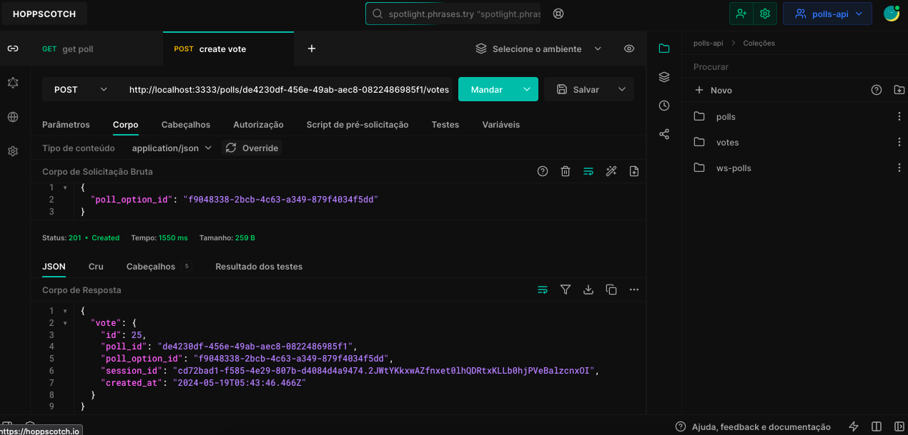

# Poll API

A real-time voting system where users can create a poll and other users can cast their votes. The system generates a ranking among the options and updates the votes in real-time.

## Requisites

- Node.js
- Docker

## HTTP

### POST `/polls`

Create a new poll.

#### Request body

```json
{
  "title": "Qual o melhor framework Node.js?",
  "options": ["Express", "Fastify", "NextJS", "HapiJS"]
}
```

#### Response body

```json
{
  "poll_id": "194cef63-2ccf-46a3-aad1-aa94b2bc89b0"
}
```

### GET `/polls/:poll_id`

Return data from a single poll.

#### Response body

```json
{
  "id": "de4230df-456e-49ab-aec8-0822486985f1",
  "title": "Qual o melhor framework Node.js?",
  "options": [
    {
      "id": "f9048338-2bcb-4c63-a349-879f4034f5dd",
      "title": "Express",
      "score": 3
    },
    {
      "id": "e57148c8-181c-4ca4-9f45-8fe14a2be981",
      "title": "Fastify",
      "score": 0
    },
    {
      "id": "3bbec41a-ecc3-4f64-9d64-d11bf82fb8de",
      "title": "HapiJS",
      "score": 1
    },
    {
      "id": "dc7197ad-4041-4e82-aa46-a11e8c098f12",
      "title": "NestJS",
      "score": 0
    }
  ]
}
```

### POST `/polls/:poll_id/votes`

Add a vote to specific poll.

#### Request body

```json
{
  "poll_option_id": "31cca9dc-15da-44d4-ad7f-12b86610fe98"
}
```

## WebSockets

### ws `/polls/:poll_id/results`

#### Message

```json
{
  "poll_option_id": "da9601cc-0b58-4395-8865-113cbdc42089",
  "votes": 2
}
```

## Setup

- Clone the repository;
- Setup PostgreSQL and Redis (`docker compose up -d`);
- Copy `.env.example` file (`cp .env.example .env`);
- Run application (`npm run dev`);

## Install dependencies

```bash
npm ci
```

## .env file

```bash
cp .env.example .env
```

## Prisma Migrate

```bash
npx prisma migrate dev
```

## Prisma Studio

```bash
npx prisma studio
```

## Run Docker Compose

```bash
docker compose up -d
```

## Run app

```bash
npm run dev
```

## Api client

- Test it! ([Hoppscotch](https://hoppscotch.io/)).

## Licença

Este projeto está licenciado sob a licença MIT.
