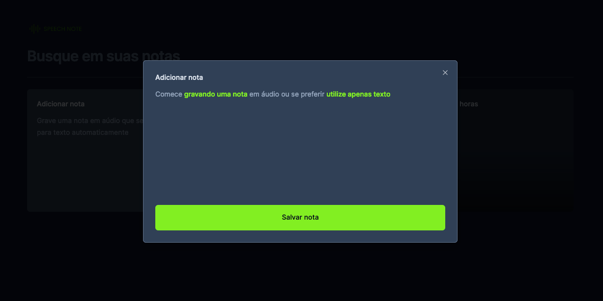

<p align="center">
  
</p>
## Aplicativo de Notas: Grave e Converta Áudio em Texto com React.

**Introdução**

Este aplicativo web permite que você grave notas de voz e as converta automaticamente em texto usando a API SpeechRecognition do navegador, ou ainda, escreva notas digitando. É ideal para quem busca uma maneira rápida e prática de capturar ideias e informações.

**Tecnologias:**

- React
- Next.js
- SpeechRecognition API

**Funcionalidades:**

- Gravação e conversão de áudio em texto
- Edição de notas (texto e áudio)
- Salvar e organizar notas
- Pesquisar notas
- Interface amigável e intuitiva

**Demonstração:**

<p align="center">
  
  
</p>

**Pré-requisitos:**

- Navegador web moderno (Chrome, Edge, etc.)
- Micrôfone funcionando

**Instalação e Execução:**

1.  Clone o repositório:

Bash

```
git clone https://github.com/Gui-dev/projects-expert.git

```

4.  Execute a aplicação:

Bash

```
npm run dev
```

5.  Acesse a aplicação em http://localhost:3000 no seu navegador.

**Contribuição:**

Agradecemos a sua contribuição para este projeto! Você pode contribuir submetendo issues e pull requests no repositório GitHub.

**Licença:**

Este projeto está licenciado sob a licença MIT.
